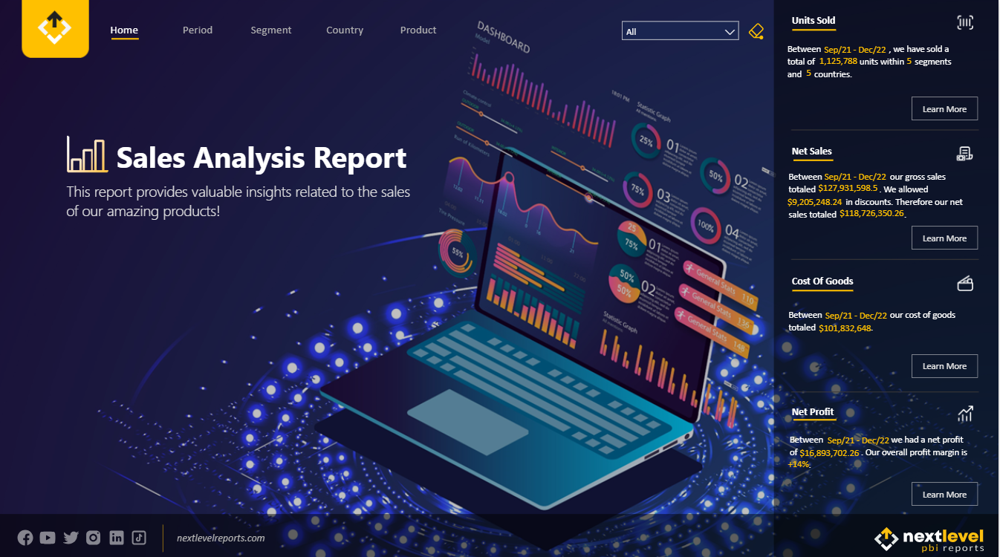
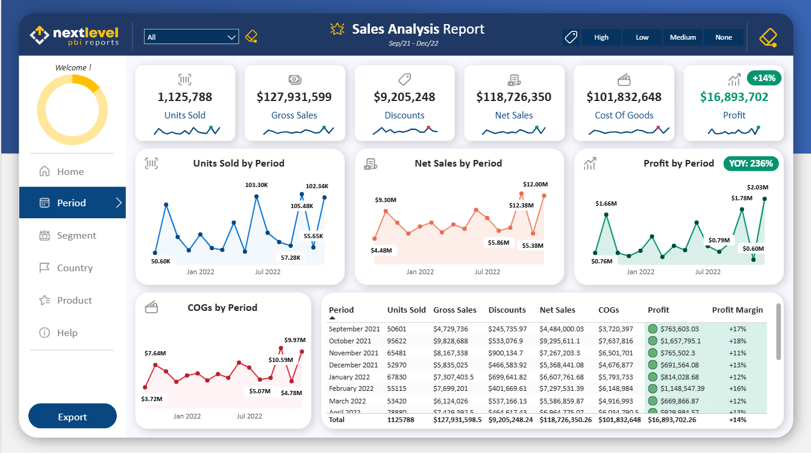
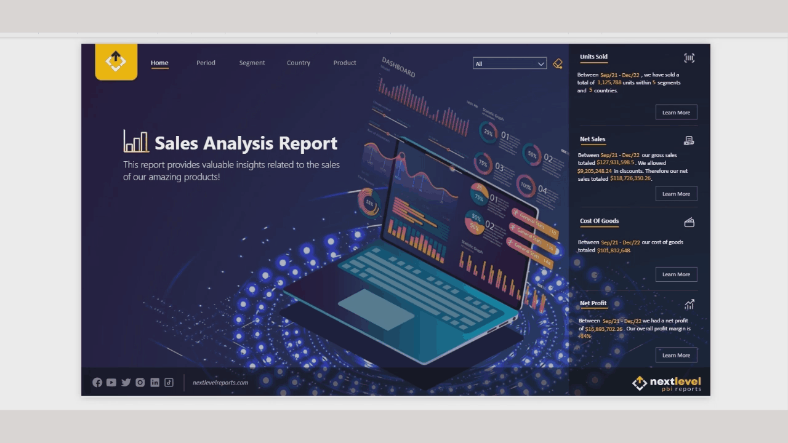

# 📊 Sales Analysis Dashboard

<p align="center">

</p>

## 📌 Overview

This project presents an interactive Power BI dashboard built to analyze sales performance across different periods, customer segments, countries, and products.

The dashboard transforms sales data into meaningful business insights through interactive visualizations, KPIs, dynamic filtering, and user-friendly navigation.

## 🎯 Business Objectives

* Analyze overall sales performance.
* Track units sold and net sales.
* Monitor discounts and cost of goods sold.
* Evaluate profit and profit margin.
* Compare performance across customer segments.
* Analyze sales performance by country.
* Identify top-performing products.
* Track sales and profit trends over time.

## 📊 Dashboard Features

* Interactive KPI Cards
* Period Analysis
* Segment Analysis
* Country Analysis
* Product Analysis
* Profit & Profit Margin Analysis
* Cost of Goods Sold Analysis
* Interactive Filters
* Dynamic Navigation
* Help Center

## 📈 Key Performance Indicators (KPIs)

* Total Units Sold
* Gross Sales
* Discounts
* Net Sales
* Cost of Goods Sold
* Total Profit
* Profit Margin

## 🛠️ Tools Used

* Power BI
* Power Query
* DAX
* Data Modeling

## 📷 Dashboard Preview

### Dashboard



## 🎥 Dashboard Demo



## 📂 Dataset

The dashboard was created using a sales dataset for educational and portfolio purposes.

## 📁 Project Structure

```text
Sales-Analysis-Dashboard
│
├── Images
│   ├── dashboard.png
│   ├── dashboard1.png
│   ├── dashboard2.png
│   ├── dashboard3.png
│   ├── dashboard4.png
│   ├── dashboard5.png
│   ├── dashboard6.png
│   ├── dashboard7.png
│   ├── dashboard8.png
│   ├── dashboard9.png
│   ├── dashboard10.png
│   └── demo.gif
│
├── Dataset
│   └── Sales.xlsx
│
└── README.md
```

## 🚀 Future Improvements

* Advanced sales forecasting
* Additional drill-through pages
* More time intelligence metrics
* Customer-level analysis
* Additional profitability insights

## 👩‍💻 Author

**Sara Farouk**

Aspiring Data Analyst

LinkedIn: https://www.linkedin.com/in/sara-farouk1/

GitHub: https://github.com/Siri1724

⭐ If you found this project helpful, consider giving it a star!
